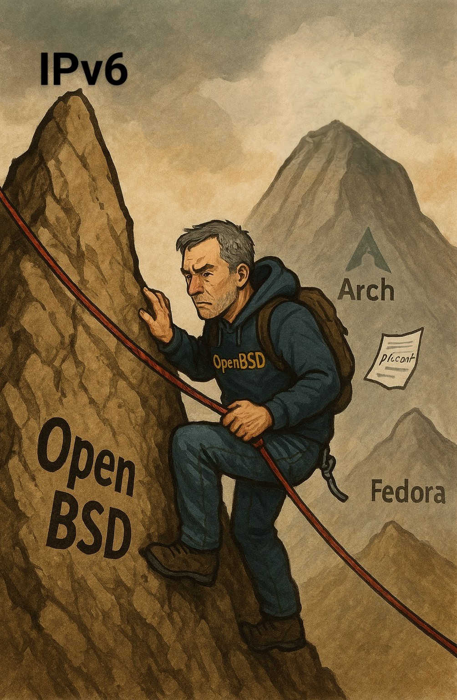

# Demystifying OpenBSD 7.7 Router/Firewalls with Verizon FiOS Dual Stack (IPv4 + IPv6)



## Overview

This guide describes a **proven method** to configure an OpenBSD 7.7-based home router/firewall with **dual stack IPv4 and IPv6** using **Verizon FiOS**. It includes support for dynamic IPv6 prefix delegation, DNS advertisement to LAN clients, DNS over TLS using `unbound` to forward to Google, and optionally, DNS blocklisting utilizing RPZ. 

## Why?

OpenBSD is a powerful, elegant, and secure operating system. It excels as a firewall/router platform, offering correctness, simplicity, and transparency. This guide shares a working configuration to help others build a reliable OpenBSD-based network gateway.

## 🔧 OpenBSD Tools Used

- OpenBSD 7.7
- `dhcpd` (IPv4 DHCP server daemon)
- `dhcpleased` - (IPv4 DHCP client daemon replacing the older ISC dhclient)
- `pf` (OpenBSD's Packet Filter)
- `slaacd` (OpenBSD's stateless address autoconfiguration daemon that automatically configures IPv6 addresses and routes using router solicitations/advertisements)
- `dhcp6leased` (OpenBSD's IPv6 prefix delegation client)
- `rad` (OpenBSD's Router Advertisement Daemon)
- `unbound` (Validating, recursive, caching DNS resolver)
- `rpz` (Response Policy Zones- DNS filtering feature in `unbound` )


# ⚠️ DISCLAIMER ⚠️

**READ THIS CAREFULLY BEFORE PROCEEDING**

This guide contains network security configurations that will control your firewall, routing, and DNS settings. **DO NOT blindly copy and paste these configurations without understanding what they do.**

**BEFORE USING THIS GUIDE:**
1. **Understand each configuration line** before applying it
2. **Test in a lab environment** first if possible
3. **Have console/physical access** to your router
4. **Keep backups** of working configurations
5. **Know how to recover** if something goes wrong

**Each network's requirements are different. Adapt accordingly and verify each setting matches your environment.**

**YOU ARE RESPONSIBLE** for understanding and securing your own network. Use this guide as reference material, not as a copy-paste solution.

---
# In this guide, ix1 is WAN, ix0 is LAN
## 📦 Installation Steps

### 1. Install OpenBSD 7.7
Follow the official instructions at: https://www.openbsd.org/faq/faq4.html

You will need a WAN interface configured with automatic IPv4/IPv6 and a LAN interface with static IPv4 for now.

### 2. Check for *running* and *enabled* daemons (slaacd **should** be enabled by default)

```sh
rcctl ls started
rcctl ls on
```

### 3. Disable `resolvd`  
We want full control over DNS (avoid using ISP DNS):

```sh
rcctl stop resolvd
rcctl disable resolvd
```
## 4. Edit configuration files
### `/etc/sysctl.conf`

```conf
# sysctl.conf for router/firewall
net.inet.ip.forwarding=1
net.inet6.ip6.forwarding=1
```
### `/etc/dhcpd.conf`
```conf

# /etc/dhcpd.conf
subnet 192.168.1.0 netmask 255.255.255.0 {
	option routers 192.168.1.1;
	domain-name-servers 192.168.1.1;
	range 192.168.1.10 192.168.1.254;
}
```
### `/etc/resolv.conf`

```conf
nameserver 127.0.0.1
nameserver ::1
lookup file bind
search home.arpa  # <--- replace with your local domain name
```
### Create `/etc/dhcpleased.conf` to ignore ISP DNS:
```conf
interface ix1 { ignore dns }
```
Enable `dhcpleased`:
```sh
rcctl enable dhcpleased
```
### `/etc/dhcp6leased.conf`:
```conf
# dhcp6leased.conf for OpenBSD 7.7
# WAN interface: ix1, LAN interface: ix0

# Request prefix delegation and assign first /64 to LAN
request prefix delegation on ix1 for { ix0/64 }

```
### `/etc/hostname.ix0` (LAN):

### Create a ULA (Unique Local Address)- IPv6's equivalent to RFC 1918 private addresses like 192.168.x.x in IPv4.
Why it's useful:

* ULAs provide stable, predictable addresses for local network communication.
* Unlike global IPv6 addresses (which can change when your ISP changes your delegated prefix), ULAs remain constant.
* Ensures local services and device-to-device communication continues working even if your ISP prefix changes-Provides a fallback for local network services.

You can easily create your own random ULA using `jot`:
```sh
jot -r 6 0 255 | xargs printf "fd00:%02x%02x:%02x%02x:%02x%02x::1/64\n"
```
The output should be something like:
```sh
fd00:AAAA:BBBB:CCCC::1/64
```
We'll use this ULA as an alias for the LAN interface.
```sh
# /etc/hostname.ix0 (LAN):
inet 192.168.1.1 255.255.255.0 192.168.1.255
inet6
inet6 alias fd00:AAAA:BBBB:CCCC::1/64  # ULA alias for LAN interface (Create your own.)
```

### `/etc/hostname.ix1` (WAN):

```sh
inet autoconf
inet6 autoconf
```
Enable and start `dhcpd`:
```sh
rcctl enable dhcpd
rcctl set dhcpd flags ix0
```
## 🔥 `pf.conf` (Firewall Rules)

A clean and concise dual stack PF configuration with minimal logging, which works with both IPv4 and IPv6. It is based on a "block all in, let anything out" foundation, with selected filtering for functionality; this is generally fine for a trusted home LAN, but again, KNOW WHAT YOU ARE DOING.

# ⚠️ IMPORTANT SECURITY DISCLAIMER ⚠️

**THIS CODE DEFINES THE SYSTEM FIREWALL BEHAVIOR. USE AT YOUR OWN RISK.**

```pf
# Interface macros
lan = "ix0"

# Martian addresses
table <martians> {
    0.0.0.0/8 10.0.0.0/8 100.64.0.0/10 127.0.0.0/8 169.254.0.0/16
    172.16.0.0/12 192.0.0.0/24 192.0.2.0/24 192.168.0.0/16
    198.18.0.0/15 198.51.100.0/24 203.0.113.0/24 224.0.0.0/3
}
table <martians6> {
    ::/128 ::1/128 ::ffff:0:0/96 100::/64 2001::/23
    2001:2::/48 2001:10::/28 2001:db8::/32 fc00::/7 fec0::/10
}

set block-policy drop
set loginterface egress
set skip on lo

match in all scrub (no-df random-id max-mss 1440)

# NAT for IPv4
match out on egress inet from !(egress:network) to any nat-to (egress:0)

# Anti-spoofing
antispoof quick for { egress $lan }
block in quick on egress inet6 from fd00::/8 to any 
#block in quick on egress inet6 from 2600:4040:AAAA:BBBB::/64 to any  # uncomment after IPv6 global address is acquired and insert your actual address

# Block martian traffic
block in quick on egress inet from <martians> to any
block return out quick on egress inet from any to <martians>
block in quick on egress inet6 from <martians6> to any
block return out quick on egress inet6 from any to <martians6>

# Default deny
block log all

# Allow anything out
pass out quick inet keep state
pass out quick inet6 keep state

# Allow LAN clients
pass in on $lan keep state

# ICMP
# IPv4
pass in quick inet proto icmp from any to any icmp-type { echoreq, unreach } keep state
# IPv6
pass in quick inet6 proto ipv6-icmp from any to any icmp6-type {
    echoreq, echorep, unreach, toobig, timex, paramprob,
    neighbrsol, neighbradv, routersol, routeradv
} keep state

# DHCPv6 client
pass in quick on egress inet6 proto udp from any port 547 to any port 546
```

## 📡 `rad.conf` (Router Advertisement)

### Initial Configuration

#### Create `/etc/rad.conf`

```conf
interface ix0 { }
```
Enable rad:
```sh
rcctl enable rad
```

## 5. REBOOT, then Acquire Delegated Prefix
(Rebooting is not strictly necessary, however, it will demonstrate that our system configuration survives a restart.)
Reboot:
```sh
reboot
```
#### Ensure rad, dhcpd, dhcpleased, and slaacd are running:

```sh
rcctl ls started
```

#### Enable and run `dhcp6leased` manually to observe prefix delegation

```sh
rcctl enable dhcp6leased
dhcp6leased -d
```

You should see something like:

```
...prefix delegation #1 2600:4040:AAAA:BBBB::/56 received on ix1 from server ...
```
Copy this prefix; We will use it to create your GUA, for the antispoofing rule in pf.conf.
#### 6. Send GUA to `ix0`:
Stop `dhcp6leased` (Ctrl+C) and start it normally:
```sh
rcctl start dhcp6leased
```
Restart `slaacd` to jumpstart assigning the GUA to ix0:
```sh
rcctl restart slaacd
```
#### 7. Update `rad.conf` with your ULA (from hostname.ix0) to advertise DNS to your LAN:

```conf
interface ix0 {
    dns {
        nameserver fd00:AAAA:BBBB:CCCC::1
    }
}
```

#### 8. Restart `rad`

```sh
rcctl restart rad
```

#### 9. Verify interface address

```sh
ifconfig ix0
```

You should see your IPv6 global address (GUA):

```
inet6 2600:4040:AAAA:BBBB::1 prefixlen 64
```

#### 10. Update `pf.conf` IPv6 antispoofing rule

Uncomment and update this line with your GUA:

```pf
block in quick on egress inet6 from 2600:4040:AAAA:BBBB::/64 to any
```

#### 11. Reload `pf` rules

```sh
pfctl -f /etc/pf.conf
```

## 12. DNS and `unbound`

Unbound is a recursive, caching DNS resolver with DNSSEC validation, DNS over TLS, and RPZ support. The following configuration forwards DNS over TLS to Google and blocks malicious domains.

### `/var/unbound/etc/unbound.conf`

```conf
server:
    interface: 127.0.0.1
    interface: ::1
    interface: ix0  # <--- replace with your actual LAN interface
    interface: ::
    interface-automatic: yes
    do-ip6: yes

    private-address: 192.168.0.0/16
    private-address: fd00::/8
    private-address: fe80::/10
    private-domain: home.arpa.

    tls-cert-bundle: "/etc/ssl/cert.pem"

    include: "/var/unbound/etc/unbound.localhosts.conf"

    local-zone: "192.168.1.0/24" static

    access-control: 0.0.0.0/0 refuse
    access-control: ::0/0 refuse
    access-control: 127.0.0.0/8 allow
    access-control: ::1 allow
    access-control: 192.168.1.0/24 allow
    access-control: fd00:AAAA:BBBB:CCCC::/64 allow

    hide-identity: yes
    hide-version: yes
    prefetch: yes

    # Enable DNSSEC:
    auto-trust-anchor-file: "/var/unbound/db/root.key"

    # Uncomment to load rpz module and configure below:
    # module-config: "respip validator iterator"

    cache-min-ttl: 3600
    serve-expired: yes

remote-control:
    control-enable: yes
    control-interface: /var/run/unbound.sock

forward-zone:
    name: "."
    forward-tls-upstream: yes
    forward-addr: 8.8.8.8@853#dns.google
    forward-addr: 8.8.4.4@853#dns.google
    forward-addr: 2001:4860:4860::8888@853#dns.google
    forward-addr: 2001:4860:4860::8844@853#dns.google

#rpz:
#    name: my preferred blocklist
#    url: https://raw-rpz-blocklist
#    rpz-action-override: nxdomain
```
Enable `unbound`
```sh
rcctl enable unbound
```

## 13. Reboot and test
Ensure rad, dhcpd, unbound, dhcpleased, dhcp6leased and slaacd are running:
```sh
rcctl ls started
```
Test your configuration from the router using the tools of your choice, e.g.:
```sh
ifconfig ix0
ping6 google.com
dig -6 google.com
dig google.com AAAA
```
https://test-ipv6.com/ can be utilized from clients.

# What is happening here (To the best of my understanding):
| Step | Daemon               | Role                                                                    |
| ---- | -------------------- | ----------------------------------------------------------------------- |
| 1    | **`slaacd`**         | Sends RS, receives Verizon RA, installs default IPv6 route on WAN `ix1` |
| 2    | **`dhcp6leased`**    | Requests delegated prefix, writes to `/var/db/dhcp6leased/ix0`          |
| 3    | **Kernel**           | Applies GUA to LAN `ix0` as directed by dhcp6leased                     |
| 4    | **`rad`**            | Advertises prefix + gateway + DNS on `ix0` (LAN)                        |
| 5    | **`unbound`**        | Serves DNS to LAN using ULA address                                     |
| 6    | **`dhcpleased`**     | Handles IPv4 autoconf on `ix1` (WAN)                                    |

## **ENJOY!**

If you have not done so already, I recommend setting up dhcpd.conf for local hostname resolution by using static reservations, in conjunction with unbound.conf. An excellent guide which expands on this is here: https://openbsdrouterguide.net/

## License

OpenBSD and this project are licensed under the **BSD style License** in the source directory of this repository.

## 👤 Author

**Misfit-138**

**"Standing on the shoulders of giants"**
* https://www.openbsd.org/faq/pf/example1.html
* https://openbsdrouterguide.net/
* https://dataswamp.org/
* https://code.jeremyevans.net/2024-11-03-adding-ipv6-to-my-home-network.html
* https://write.jeffreyforman.net/posts/2022/verizon-fios-native-ipv6/


## ❓ FAQ

### Why OpenBSD?

Because it does the job simply, securely, and elegantly. It's ideal for a firewall/router role (I use it on my desktop and laptop). OpenBSD is simply the most beautiful modern OS.
I found it 20 years ago, (though I am still a novice) fell in love with it, and I have donated to the project. I hope this page contributes to the project by helping someone.

### Why not Linux or FreeBSD?

They're great tools, but I find them unnecessarily complex, especially for routing/firewalling. OpenBSD has fewer surprises and a consistent, coherent philosophy.

### Why Google DNS?

- In my region, Google DNS is fast and reliable.
- Other providers and root servers did not perform well for me.
- Feel free to configure your system to your own preference.
  
### Aren’t Verizon FiOS delegated prefixes dynamic?

Theoretically, yes; They can change. If this concerns you, I recommend creating a script which detects the change, writing it to a file, and `include` the file in `pf.conf`, so the IPv6 antispoof rule remains intact.

## 🙏 Final Thoughts

This guide exists to help others get a solid OpenBSD dual stack router working with Verizon FiOS. I spent weeks testing, reading, and tweaking. If it helps one person, it was worth the effort.
