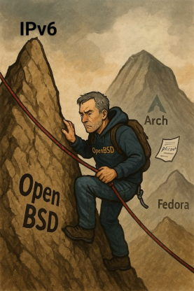
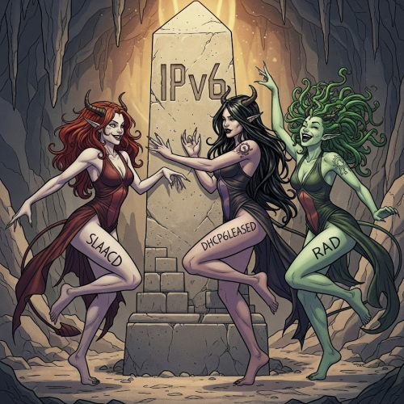

# Creating an OpenBSD 7.8 Router/Firewall with Dual Stack (IPv4 + IPv6)



## Overview

This guide describes a **proven method** to configure an OpenBSD 7.8-based router/firewall with **dual stack IPv4 and IPv6** using residential **Verizon FiOS** (It will also work with other ISPs that use similar connectivity). It includes support for dynamic IPv6 prefix delegation, DNS advertisement to LAN clients, DNSSEC, root server querying, or DNS over TLS using `unbound` to forward to Google, and optionally, DNS blocklisting utilizing RPZ.


Additionally, it attempts to explain how all the relevant components work together, under the hood, to provide functionality.

## Why?

- Because IPv6 is new and mysterious to me, and in my pursuit of understanding it, I wanted to share something with the community that may be helpful.
- Because I simply could not find a guide like this anywhere.
- Because if you cannot explain it, you do not understand it.
- Because simplicity is beautiful; OpenBSD is beautiful. It excels as a firewall/router platform, offering correctness, security, elegance and transparency. It resists the trend to incorporate bloatware disguised as features, inefficiency disguised as modernity, and unnecessary complexity. 

This guide shares a working configuration to help others build a reliable OpenBSD-based network gateway using the default tools found in the `base` system.

After reading, you should have a working understanding of what your OpenBSD firewall/router is doing and how it does so.

## 🔧 OpenBSD `base` Tools Used

- OpenBSD 7.8
- `pf` (OpenBSD's Packet Filter)
- `dhcpd` (IPv4 DHCP server daemon)
- `dhcpleased` - (OpenBSD's IPv4 DHCP client daemon replacing the older ISC dhclient)
- `dhcp6leased` (OpenBSD's IPv6 prefix delegation client)
- `rad` (OpenBSD's Router Advertisement Daemon)
- `slaacd` (StateLess Address Automatic Configuration daemon)
- `unbound` (Validating, recursive, caching DNS resolver)
- `rpz` (Response Policy Zones- DNS filtering feature in `unbound` )

## Hardware requirements:

Your choice of hardware will be dictated by your own network requirements, but, generally, a machine with at least 2 NICs (one for WAN, one for LAN) that is of a supported architecture will work.
Intel NICs are particularly well supported.

# ⚠️ DISCLAIMER ⚠️

**READ THIS CAREFULLY BEFORE PROCEEDING**

This guide contains network security configurations that will control your firewall, routing, and DNS settings. **DO NOT blindly copy and paste these configurations without understanding what they do.**

**BEFORE USING THIS GUIDE:**
1. **Understand each configuration line** before applying it
2. **Test in a lab environment** first if possible
3. **Have console/physical access** to your router
4. **Keep backups** of working configurations
5. **Know how to recover** if something goes wrong

**Each network's requirements are different. Adapt accordingly and verify each setting matches your environment.**

**YOU ARE RESPONSIBLE** for understanding and securing your own network. Use this guide as reference material, not as a copy-paste solution.

---
# In this guide, ix1 is the WAN interface, ix0 is the LAN interface 

## 📦 Installation Steps

## 1. Install OpenBSD 7.8
Official instructions at: https://www.openbsd.org/faq/faq4.html

During the install set up a WAN interface configured with automatic IPv4/IPv6 and a LAN interface with static IPv4 for now.

## 2. Temporarily disable daemons 

Check for *running* and *enabled* daemons 

```sh
rcctl ls started
rcctl ls on
```

*Temporarily disable the following daemons until we have a proper firewall.*

`slaacd` is automatically started on interfaces marked with `inet6 autoconf` in `/etc/hostname.if`, so it should be enabled and running on `ix1` after a fresh install if you chose IPv6 autoconf. 

Disable for now:
```sh
rcctl stop slaacd
rcctl disable slaacd
```

`dhcp6leased` is automatically started on interfaces marked with `inet6 autoconf` in `/etc/hostname.if`, so it should be enabled and running on `ix1` after a fresh install if you chose IPv6 autoconf. 

Disable for now:
```sh
rcctl stop dhcp6leased 
rcctl disable dhcp6leased 
```

`dhcpleased` is automatically started on interfaces marked with `inet autoconf` in `/etc/hostname.if`, so it should be enabled and running on `ix1` after a fresh install if you chose IPv4 autoconf. 

Disable for now:
```sh
rcctl stop dhcpleased 
rcctl disable dhcpleased 
```

## 3. Permanently disable `resolvd` (IPv4/IPv6)

Unless it is stopped and disabled, `resolvd` will continually overwrite `/etc/resolve.conf` and the ISP's DNS will be assigned to the router via DHCP:

```sh
rcctl stop resolvd
rcctl disable resolvd
```
## 4. Edit configuration files
### `/etc/sysctl.conf`  (IPv4/IPv6)
Turning the system into a router that will forward IPv4/IPv6 packets between network interfaces is simple and easy:

```sh
sysctl net.inet.ip.forwarding=1

sysctl net.inet6.ip6.forwarding=1
```
Ensure persistence across reboots:
```conf
# /etc/sysctl.conf for router/firewall
net.inet.ip.forwarding=1
net.inet6.ip6.forwarding=1
```

### `/etc/dhcpd.conf`  (IPv4)
Setting up an IPv4 DHCP server is also straightforward.

A simple, sane, working example:
```conf

# /etc/dhcpd.conf
subnet 192.168.1.0 netmask 255.255.255.0 {
	option routers 192.168.1.1;
	option domain-name-servers 192.168.1.1;
	range 192.168.1.10 192.168.1.254;
}
```
### `/etc/resolv.conf`  (IPv4/IPv6)
This file configures the resolving behavior of *the router itself.*
```conf
# /etc/resolv.conf
nameserver 127.0.0.1
nameserver ::1
lookup file bind
search home.arpa  # <--- you may choose to replace 'home.arpa' with a custom local domain name
```
`nameserver 127.0.0.1`: Use the local DNS server running on IPv4 loopback (localhost). This means the system will try to send DNS queries to itself at 127.0.0.1.

`nameserver ::1`: Same as above, but for IPv6 loopback. This allows DNS queries to be sent to localhost using IPv6.

`lookup file bind`: This controls the order of name resolution:

`file`: means check the /etc/hosts **file** first.

`bind`: Originally meant the **Berkeley Internet Name Domain (BIND)** software, which is the original and widely used DNS resolver and server suite developed at Berkeley in the early days of the Internet. It’s a legacy term that stuck. Nowadays, it simply means *ask the DNS servers listed above (127.0.0.1 and ::1) if the name wasn’t found in /etc/hosts*.

`search home.arpa`: If you type just a short hostname within a command (like, `ping myserver`), *from the router command line*, the system will try appending `.home.arpa` to it, making it `ping myserver.home.arpa`. This just expedites resolving local hostnames *from the router*. 

*(RFC 8375 `home.arpa` is recommended. It provides a dedicated, reserved, and safe domain for local home use. Of course, you may replace with a custom domain name of your choosing)*


### Create `/etc/dhcpleased.conf`  (IPv4)

dhcpleased does the following:
- Runs on interface(s) configured with `inet autoconf` (`ix1` in our example)
- Sends DHCP Discover/Request messages to find and lease an IPv4 address.
- Receives offers from a DHCP server, selects one, and requests it.
- Writes lease info to /var/db/dhcpleased/ so it persists across reboots.
- Configures your interface with:
  - IPv4 address
  - Default gateway (route add default)
  - DNS resolvers (written to /etc/resolv.conf)
  - Renews leases as needed to keep the IP assignment active.

The following simple example will ignore ISP DNS assignment (recommended). Also, be sure to disable `resolvd`, (recommended above). This gives us full control over our DNS:
```conf
# /etc/dhcpleased.conf
interface ix1 { ignore dns }
```

### `/etc/dhcp6leased.conf`:  (IPv6)

`dhcp6leased` is based on `dhcpleased` and serves a similar purpose and function, but for IPv6. It runs on interface(s) configured with `inet6 autoconf`.

This simple file is all that is needed:
```conf
# /etc/dhcp6leased.conf
request prefix delegation on ix1 for { ix0/64 }
```
**(WAN interface: ix1, LAN interface: ix0)**
## Explaining this simple file with IPv6 Math
- IPv6 addresses are 128 bit.
- Verizon gives out /56 prefixes; The first 56 bits are *fixed* by Verizon.
- A *prefix* defines an IPv6 *subnet*.
- Each /64 subnet: The first 64 bits define the subnet. And, since the first 56 are fixed,
- Bits 56 to 64 = 64 - 56 = 8 bits, so,
- 8 bits are available for our own subnetting.
- With 8 bits, we can have 2^8 = 256 different values (0 through 255). This gives us 256 possible /64 subnets for our network.
- **A /64 prefix defines an IPv6 subnet** that contains 18 Quintillion addresses; Every address in those subnets is a GUA (Global Unicast Address)- Quite generous. 
- The remaining 64 bits are client **SLAAC** territory.
  
## *The `/etc/dhcp6leased.conf` syntax does exactly what it implies: Request prefix delegation on WAN `ix1` and assign the first /64 to LAN `ix0`*

## Breakdown: ##

56 bits: Fixed by Verizon (2006:4040:1234:56)

8 bits: Yours for subnetting (00, 01, 02... ff)

64 bits: Host addresses within each subnet (SLAAC territory)

Math check:
56 + 8 + 64 = 128 bits

What this gives you:
- 256 possible subnets (from your 8 bits: 2^8 = 256)
- Each subnet can have ~18 quintillion hosts (from the 64 host bits: 2^64)

Example subnet:

2006:4040:1234:5601::/64

2006:4040:1234:56 = Verizon's 56 bits

01 = Your subnet choice (1 of 256 possible)

:: = 64 zero bits available for host addresses

2006:4040:1234:5601::1 (assigned by `dhcp6leased` on OpenBSD router `ix0` (LAN))

On the 2006:4040:1234:5601::/64 subnet, the various PCs/phones/laptops on your LAN running their own SLAAC clients assign their own GUAs like so:

2006:4040:1234:5601::a1b2:c3ff:fed4:5678 (assigned by device 1 SLAAC client)

2006:4040:1234:5601::f3d5:12ef:57fe:1234 (assigned by device 2 SLAAC client)

...etc.

So yes - we get 256 massive subnets, each capable of holding far more devices than exist on Earth.
# Every address in those subnets is a GUA (Global Unicast Address).
> 
> **Why they're all GUAs:**
> * **Global routing prefix**: `2006:4040::/32` is allocated to Verizon by IANA
> * **Globally routable**: Any address starting with `2006:4040:` can be reached from anywhere on the IPv6 internet
> * **Unique worldwide**: No other network uses your specific `/56` prefix
> 
> **So all of these are GUAs:**
> * `2006:4040:1234:5600::1` (router LAN interface on subnet 0)
> * `2006:4040:1234:5601::4axx:93cb` (a device on subnet 1)
> * `2006:4040:1234:56ff::a1b2:c3d4` (a device on subnet 255)
> 
> **What makes them "global":**
> * They're not private/local addresses (like `fc00::/7` or `fe80::/10`)
> * They're not multicast (`ff00::/8`) or reserved ranges
> * They're part of the global IPv6 routing table
> 
> **The beauty of IPv6:** Unlike IPv4 where you typically get one public IP and NAT everything else, with IPv6 every device gets its own globally routable address. Your laptop, phone, IoT devices - they all get real internet addresses that can be reached directly (subject to firewall rules).
> 
> We have 256 subnets, each with ~18 quintillion globally unique, internet-routable addresses.
>

### `/etc/hostname.ix0` (LAN):  (IPv4/IPv6)

### For internal network services, create a ULA (Unique Local Address)- IPv6's equivalent to RFC 1918 private addresses like 192.168.x.x in IPv4.
Why it's useful:

* **ULA**s provide stable, predictable addresses for local network communication.
* Unlike **GUA**s (which can change when your ISP changes your delegated prefix), **ULA**s remain constant.
* Ensures local services and device-to-device communication continues working even if your ISP prefix changes-Provides a fallback for local network services.

ULAs are private and not routable on the internet, so feel free to arbitrarily create your own ULA which is human readable;
```fd00:feed:face::1/64``` 
```fd10:dead:fade:1/64```
```fd1a:cafe:c0de::1/64```
are all perfectly acceptable.

So, now we have:
- A ULA: fd00:AAAA:BBBB:CCCC::1 = ULA (the individual address)
- A subnet/prefix: fd00:AAAA:BBBB:CCCC::/64 = ULA prefix (the subnet)

Terminology clarification:

When we write out fd00:AAAA:BBBB:CCCC::1/64, we are specifying:
- The *individual ULA address*: fd00:AAAA:BBBB:CCCC::1 with subnet information: /64
- The *prefix* is: fd00:AAAA:BBBB:CCCC::/64

We will use the ULA as an alias for the LAN interface in `hostname.ix0` and `rad.conf` to advertise to our LAN clients. The prefix will be used in `unbound.conf`, to allow incoming DNS requests.  In this way, we have a permanent address on our LAN interface as well as a /64 subnet for private use that will not change, unlike the dynamic prefix and the Global Unicast Address (GUA) from the ISP assigned to the LAN. *More on this later.*

```sh
# /etc/hostname.ix0 (LAN):
inet 192.168.1.1 255.255.255.0 192.168.1.255
inet6
inet6 alias fd00:AAAA:BBBB:CCCC::1/64  # ULA alias for LAN interface (Create your own.)
```
- `inet 192.168.1.1 255.255.255.0 192.168.1.255`:  Assigns a static IPv4 address to the interface, using a standard /24 subnet. Devices on the LAN will use this as their IPv4 gateway.

- `inet6`:  Enables IPv6 processing on the LAN interface. With this flag, the kernel will create a link-local address (LLA) for our LAN interface when it is brought up, and allow `dhcp6leased` to assign a Global Unicast Address (GUA) to it later. Recall our `dhcp6leased.conf`; `request prefix delegation on ix1 for { ix0/64 }`

- `inet6 alias fd00:AAAA:BBBB:CCCC::1/64`:  Assigns a stable Unique Local Address (ULA) to the LAN interface for use with internal-only services (like DNS via `unbound`, `ssh` from LAN clients, etc), providing consistent local IPv6 reachability even if the delegated GUA prefix changes or is unavailable.

This simple setup ensures:
- Dual-stack (IPv4 + IPv6) support on the LAN
- A fixed local IPv4 address  
- A fixed local IPv6 address (ULA) for internal services, like DNS

### `/etc/hostname.ix1` (WAN) should *probably* be configured during install if you followed the directions above:  (IPv4/IPv6)
Simple, clean and brainless. And, it *just works*:
```sh
# /etc/hostname.ix1 (WAN)
inet autoconf
inet6 autoconf
```

- `inet autoconf`: Enables DHCPv4 on the WAN interface. The system will automatically obtain a public IPv4 address, subnet mask, and default gateway from the ISP via `dhcpleased`.
- `inet6 autoconf`: Enables IPv6 autoconfiguration on the WAN interface. This brings up the interface with a link-local IPv6 address (LLA), installs a default route via `slaacd`, and opens communication with the ISP’s DHCPv6 server for prefix delegation via `dhcp6leased`.

**With `hostname.ix1`, `hostname.ix0`, and `dhcp6leased.conf` complete, `dhcp6leased` is now configured to receive the delegated prefix on the WAN, write it to `/var/db/dhcp6leased/ix1` and install a GUA within its subnet ending in ::1 to the LAN interface. `slaacd` is now configured to process ISP router advertisements and install the default route.**
  
### 🔥 `/etc/pf.conf` (Firewall Rules)  (IPv4/IPv6)

A clean and concise dual stack PF configuration with minimal logging, which works with both IPv4 and IPv6. It is based on a "block all in, let anything out" foundation, with security against spoofing, and selected filtering for functionality; this verbatim configuration is generally fine for a trusted home LAN, but again, KNOW WHAT YOU ARE DOING.

## *IPv6 essential considerations:*
- There must be a route-to or pass out rule in `pf.conf` for IPv6 outbound from LAN to WAN. This is easy to forget and will silently block IPv6. This is covered, because our example let's everything out- `pass out quick inet6 keep state`.
- ICMPv6 needs to be allowed on WAN and LAN or many things break- neighbor discovery, path MTU discovery, RA, etc. This is covered by `pass in quick inet6 proto ipv6-icmp from any to any icmp6-type {
    echoreq, echorep, unreach, toobig, timex, paramprob,
    neighbrsol, neighbradv, routersol, routeradv
} keep state`
- The router's WAN `ix1` must allow inbound UDP port 546 traffic from the ISP DHCPv6 server’s UDP port 547. This is how `dhcp6leased` communicates and receives its IPv6 delegated prefix. Our example covers this with `pass in quick on egress inet6 proto udp from any port 547 to any port 546`.

# ⚠️ IMPORTANT SECURITY DISCLAIMER ⚠️

**THIS CODE DEFINES THE SYSTEM FIREWALL BEHAVIOR. USE AT YOUR OWN RISK.**

```
# OpenBSD pf.conf - Clean and Concise - Dual Stack (IPv4 + IPv6)

# Interface macros
lan = "ix0"

# Martian (unroutable) addresses
table <martians> { \
    0.0.0.0/8 10.0.0.0/8 100.64.0.0/10 127.0.0.0/8 169.254.0.0/16 \
    172.16.0.0/12 192.0.0.0/24 192.0.2.0/24 192.168.0.0/16 \
    198.18.0.0/15 198.51.100.0/24 203.0.113.0/24 224.0.0.0/3 \
}
# NAT64 well-known prefixes (RFC 6052, RFC 8215) are safe to block *unless* you
#   later deploy NAT64 or CLAT. If so, remove or adjust the 64:ff9b:: entries.
table <martians6> { \
    ::/128, ::1/128, ::/96, ::ffff:0:0/96, \
    64:ff9b::/96, 64:ff9b:1::/48, \
    100::/64, 2001::/23, 2001:2::/48, 2001:10::/28, 2001:20::/28, \
    2001:db8::/32, 2002::/16, fc00::/7, fec0::/10 \
}


# Global options
set block-policy drop
set loginterface egress
set skip on lo

# Traffic normalization
match in all scrub (no-df random-id max-mss 1440)

# NAT
match out on egress inet from !(egress:network) to any nat-to (egress:0)

# Anti-spoofing
antispoof quick for { egress $lan }

# Block martian addresses
block in quick on egress inet from <martians> to any
block return out quick on egress inet from any to <martians>
block in quick on egress inet6 from <martians6> to any
block return out quick on egress inet6 from any to <martians6>

# Default Deny
block log all

# Allow anything out
pass out quick inet keep state
pass out quick inet6 keep state

# Allow LAN in
pass in on $lan keep state

# ICMP 
pass in quick inet proto icmp from any to any icmp-type { echoreq, unreach } keep state
pass in quick inet6 proto ipv6-icmp from any to any icmp6-type { \
    echoreq, echorep, unreach, toobig, timex, paramprob, \
    neighbrsol, neighbradv, routersol, routeradv \
} keep state

# DHCPv6 client
pass in quick on egress inet6 proto udp from any port 547 to any port 546
```
### Check `pf.conf` for errors:
```sh
pfctl -nf /etc/pf.conf
```

No output=No errors.

### Reload `pf` rules:  (IPv4/IPv6)

```sh
pfctl -f /etc/pf.conf
```

## 5. Start `dhcpleased` (IPv4)
Now that we have a proper firewall in place, we can start connections.

Start `dhcpleased` with:
```sh
rcctl enable dhcpleased
rcctl start dhcpleased
```
At this point, you may wish to go back and re-check your resolv.conf, to ensure it has not been overwritten.
### Check WAN for public IPv4 address:
```sh
ifconfig ix1
```
You should see a valid IPv4 address.

## 6. Start `slaacd`:  (IPv6)

`slaacd` will process RAs from the ISP to establish a default route on the WAN interface (`ix1`)

```sh
rcctl enable slaacd
rcctl start slaacd
```

## 7. Acquire Delegated Prefix (IPv6)

### Enable and run `dhcp6leased` to initiate prefix delegation

Open another terminal and do:
```sh
tcpdump -ni ix1 udp and port 546 or port 547 and ip6
```
Go back to the original terminal and do:
```sh
rcctl enable dhcp6leased
rcctl start dhcp6leased
```
Recall from above that we configured `/etc/hostname.ix1` with `inet6 autoconf`. Therefore, `dhcp6leased` is called on `ix1`.

Return to the `tcpdump` terminal.

You should see something like:

```
...prefix delegation #1 2600:4040:AAAA:BBBB::/56 received on ix1 from server ...
```

Having negotiated the lease, `dhcp6leased` writes the prefix to `/var/db/dhcp6leased/ix1` for persistence.

## 8. 📡 Create `/etc/rad.conf` (Router Advertisement)  (IPv6)

```conf
# /etc/rad.conf
interface ix0 {
    dns {
        nameserver fd00:AAAA:BBBB:CCCC::1  # Your custom ULA alias from hostname.ix0
    }
}
```
*Substitute with your actual ULA.*

By default, `rad` discovers prefixes to announce by inspecting the IPv6 addresses configured on an interface; At this point, the delegated prefix from the ISP, and the prefix (subnet) encompassing our ULA.

`dns {nameserver fd00:AAAA:BBBB:CCCC::1}` configures `rad` to advertise the DNS nameserver (ULA) to your LAN. 

This means:
- Clients will receive both the *delegated prefix* (2600:4040....::/64) and the *ULA's prefix* (fd00:AAAA:BBBB:CCCC::/64) even though not explicitly included in `rad.conf`
- Clients also receive the custom DNS (ULA) *address* (fd00:AAAA:BBBB:CCCC::1) configured above.
- Clients will autoconfigure GUA addresses like 2600:4040:AAAA:BBBB::abcd for themselves, derived from the delegated prefix, using their own SLAAC client.
- These GUAs give each device on your network a publicly routable IPv6 address.
- Clients will autoconfigure private ULA addresses like fd00:AAAA:BBBB:CCCC::abcd for themselves derived from the ULA's prefix using their own SLAAC client.
- *Clients then use those private ULA source addresses to query DNS* at your router’s ULA (fd00:AAAA:BBBB:CCCC::1).

## *Why use a ULA for DNS? Why not use our GUA derived from Verizon's delegated prefix? After all, it's our LAN interface's IP address!*

By creating a ULA alias for our LAN `ix0`, and a corresponding prefix, we've essentially created a *private* ULA subnet (fd00:AAAA:BBBB:CCCC::/64) on the LAN for the purpose of stable internal services (like DNS, and `ssh` from LAN clients). We will configure `unbound` to listen on the LAN interface, and *allow traffic in from the ULA address fd00:AAA:BBBB:CCCC::1, and its subnet*. You will also be able to `ssh` into the router using the ULA.

Advertising our GUA as our DNS is not best practice, because GUAs are publicly routable addresses. Yes, `pf` will block the advertisement from leaving, but using a private subnet is advantageous.

This concept was strange to me at first, since, coming from the frugality of IPv4, it seemed excessive to theoretically provision 18 quintillion addresses simply for my little network's DNS. 

But, IPv6 actually encourages this for:
- Stability: Your ULA doesn’t change like your ISP-assigned dynamic GUA. This makes it a perfect anchor for DNS, which needs consistency.
- Privacy: ULAs are not routable on the public Internet, so there is no exposure.
- Simplicity: You avoid having to dynamically reconfigure `unbound` in case your dynamic GUA changes.
- Reachability: Clients can always find Unbound at fd00:AAAA:BBBB:CCCC::1, even if your global prefix changes.

## 9. Enable and start `rad`  (IPv6)
Enable and start rad, so that it advertises the delegated *prefix*, the ULA *prefix*, and DNS info (*ULA address* in our case) on the LAN.  

You can verify that the delegated prefix, ULA prefix and ULA are advertised using `tcpdump`:

Open another terminal and do:
```sh
tcpdump -i ix0 -s 256 -vvv -n icmp6 and 'ip6[40] == 134'
```
Switch to your original terminal and do:
```sh
rcctl enable rad
rcctl start rad
```
Then switch back to watch the output from `tcpdump`. You should see your delegated prefix (DP), ULA prefix, as well as the ULA being advertised.

*I struggled understanding this for weeks until dave14305 was kind enough to share his insight on this. The `-s 256` was the key. Without it, output was truncated (it would contain either the ULA or GUA, but never both) and confused me for a long time. Thank you, dave!*

## 10. Enable and start `dhcpd` to serve IPv4 addresses on the LAN: (IPv4)
```sh
rcctl enable dhcpd
rcctl set dhcpd flags ix0
rcctl start dhcpd
```
## 11. Reboot and verify.
Rebooting is not strictly necessary at this point, but it will prove our configurations survive a system restart.

```sh
reboot
```
Verify WAN public IPv4 and IPV6 link-local addresses:
```sh
ifconfig ix1
```

Verify LAN address assignments:  (IPv4/IPv6)

```sh
ifconfig ix0
```

In addition to your static IPv4 LAN address, you should see your IPv6 Global Unicast Address (GUA):

```
...
inet 192.168.1.1
...
inet6 2600:4040:AAAA:BBBB::1 prefixlen 64
```
Verify connectivity:
```sh
ping 8.8.8.8
ping6 2001:4860:4860::8888
```
*You are getting close to the summit!*

## The IPv6 Prefix Delegation model (This ain't IPv4!):

Verizon FiOS assigns a **delegated IPv6 prefix** (typically a /56) to your router via DHCPv6 rather than assigning a Global Unicast Address (GUA) directly to the router’s WAN interface. This aligns with IPv6’s design principles, which support end-to-end connectivity without the need for NAT.

## How It Works on OpenBSD 7.8

**`slaacd`** runs on the OpenBSD router's WAN interface, processing the RA from the ISP, and installs a default route.

**`dhcp6leased`** handles all *DHCPv6* communication with the ISP on the WAN interface. It sends a request for prefix delegation (IA_PD) and receives a delegated prefix, usually a /56. It then subdivides that prefix according to its configuration and **records subprefixes assigned to each LAN interface** in its internal lease database located at `/var/db/dhcp6leased/`. In our `hostname.ix1` file, `dhcp6leased` is configured to assign the prefix to `ix0` (our LAN interface).

**`rad`** (Router Advertisement Daemon) obtains the delegated prefix (DP) information from the WAN interface according to its configuration in ```/etc/rad.conf```. It then constructs the router advertisement messages and sends them out on the LAN interface(s), to advertise the corresponding prefix (subnet) (and DNS subnet based on our ULA, as configured in our case). This allows LAN clients to self-configure IPv6 addresses using their own SLAAC services. Note that LAN clients will end up with several IPv6 addresses, including their own LLAs, as well as the SLAAC-configured GUAs and ULAs based on the advertised DP and ULA prefix- this is normal and by design on IPv6.

### Why This Design Works and is Superior

**No WAN GUA Needed**  
Unlike IPv4, where a public WAN address is translated to the LAN using NAT, IPv6 routers simply route packets using their delegated prefix. There is no need for a GUA on the WAN interface in this setup.

**Link-Local Sufficient**  
Simply bringing an interface up with the `inet6` or `inet6 autoconf` flags will give the interface a link-local address and calls `slaacd`. `slaacd` then negotiates the default route; Our router's WAN interfaces link-local IPv6 address (`fe80::/10`) communicates with the Verizon upstream routers LLA.  This is sufficient because routing globally (sending packets out to the internet) does not require a Global Unicast Address (GUA) on the WAN interface. *It only requires a default route.* (An LLA on WAN is also sufficient for Comcast/Xfinity according to one user. Please drop me a line with information on your ISP so I may list it here: misfit138x[at]proton[dot]me)

**Delegated GUA on LAN interface**  
Our router receives its own IPv6 address on each LAN interface via `dhcp6leased`. These addresses are derived from the delegated prefix. The LAN interface prefix(es) are then advertised throughout their internal networks via `rad`, so that client devices may configure their own GUAs, (and ULAs, in our case) using SLAAC.

**Efficient and Compliant**  
This design reflects IPv6 best practices and conserves address space while enabling native, end-to-end IPv6 routing for all LAN clients- without NAT.

**No Direct Global Reachability** 
The WAN's LLA is strictly non-routable beyond the local link (our router's LLA to the ISP router's LLA). An attacker on the internet attempting to connect directly to the router's WAN IP via a GUA will fail because no such address exists on that interface.

**Reduced Scanning Footprint** 
Many botnets and general vulnerability scanners run automated sweeps across the IPv6 GUA space. Since our router is not using a GUA on the WAN and it is not being advertised by the ISP, it falls entirely outside these global sweeps. 

**Reduced Attack Surface**
This configuration provides maximum reduction in two crucial ways:

1.) Elimination of the WAN Target: Removing the GUA from the WAN interface eliminates the easiest and most frequently targeted address on the router itself. If our router had a GUA, the ISP would have placed a route for that GUA into the global routing tables. The only way to engage the router is via the LLA, which is non-routable, or by attacking an internal host's GUA, which forces the traffic through the full `pf` rule set. This elimination is a genuine reduction in the target surface.

The Hacker's View: Botnets sweep address blocks that are known to be routed through a major ISP (like FiOS). If they sweep the block containing the router's WAN GUA, the traffic finds its way directly to our router's WAN port.

LLA-only WAN: Since our router doesn't configure a GUA on the WAN, the destination address is missing, and the packet is immediately dropped by the kernel.

2.) Perfect PF Granularity: The remaining attack surface is the entire 2600:xxxx:yyyy:zzzz::/64 prefix, which is now entirely protected by a stateful firewall. Every single incoming connection requires a specific, explicit pass rule in our pf.conf.

This is the key difference from typical consumer routers, which often have GUAs on both interfaces (and may expose ports by default). Our setup gives absolute control over the routing table and firewall.

## *But, a decent `pf.conf` could just as easily "block all" on a WAN with a GUA, right? So is the reduced attack surface merely an illusion?*

It is true that a decent pf.conf rule set could simply:
```sh
block in quick on $WAN_IF inet6 proto tcp from any to $WAN_GUA
```
This rule seems to achieve the same result as having no GUA at all. However, the reduced attack surface is not an illusion; it is a real, subtle, and critical security gain due to OpenBSD's architecture.

Here is the technical comparison:

🔍 LLA-Only WAN vs. GUA-Configured WAN

The difference lies in where the packet is discarded and the system resources required to do so.

Scenario A: Our Configuration (LLA-Only WAN)

Incoming Packet: A malicious packet arrives at our router's WAN port, destined for a GUA (e.g., 2600:xxxx:yyyy:zzzz::f00d).

Kernel Check: The packet is processed by the network interface driver and the kernel's IP stack.

The Decision: The kernel checks its interface list and sees that no interface is configured with that GUA.

Action: The packet is immediately and efficiently discarded by the kernel's IP stack. It never reaches the `pf` daemon.

Resource Load: Minimal. This is the fastest and most resource-efficient way to discard traffic.

Scenario B: GUA-Configured WAN with a block Rule

Incoming Packet: A malicious packet arrives at our router's WAN port, destined for a GUA (e.g., 2600:xxxx:yyyy:zzzz::f00d).

Kernel Check: The kernel checks its interface list and sees that the GUA exists on the $WAN_IF interface.

Action: The kernel accepts the packet and passes it to the firewall, `pf(4)`.

PF Check: `pf` must load, parse, and match the packet against all active rules until it hits the explicit blocking rule.

Action: `pf` then discards the packet.

Resource Load: Increased. The packet consumes CPU cycles for kernel-to-PF communication, rule processing, and state evaluation (even if no state is created). In a DDoS or large-scale sweep, this can contribute to resource exhaustion.

💡 The Security and Stability Advantage

The reduced attack surface comes down to two key points:

**Defense-in-Depth:**

With an LLA-only WAN, we are relying on a kernel feature (address non-existence) as our first line of defense.

With a GUA-configured WAN, we are relying on a daemon (`pf`) as our first line of defense. While `pf` is highly robust, relying on the kernel's basic functionality provides a more fundamental layer of protection that is less susceptible to misconfiguration or potential daemon issues.

**Performance and Stability:**

In a high-volume attack (DDoS or intense sweep), every packet that bypasses the kernel's quick discard and forces `pf` to do work contributes to potential system slowdown or instability. By eliminating the GUA, we are offloading the majority of scanning traffic from the firewall daemon entirely, ensuring `pf` is only busy filtering valid traffic meant for forwarding.

Therefore, the reduced attack surface is a tangible benefit in both stability and security hardening. It leverages the design philosophy of OpenBSD: simplify the network stack and remove unnecessary elements that could be attacked or misconfigured.

The LLA-only WAN configuration ensures the kernel performs the most immediate and efficient blocking of global attacks against the router itself.

## 12. DNS and `unbound`  (IPv4/IPv6)

### Unbound is a recursive, caching DNS resolver with DNSSEC validation, DNS over TLS, and RPZ support. 


### The following example allows for using the root servers or forwarding DNS over TLS to Google, as well as blocking malicious domains, depending on how you wish to proceed.

### `/var/unbound/etc/unbound.conf`

```conf
# /var/unbound/etc/unbound.conf
# uncomment what is needed/preferred
server:
    interface: ix0  # All IPv4 and IPv6 addresses assigned to this LAN interface. (192.168.1.1, GUA and ULA)
    interface: 127.0.0.1  # Loopback on the router itself
    interface: ::1  # ipv6 Loopback on the router itself
    
    private-address: 192.168.0.0/16
    private-address: fd00::/8
    private-address: fe80::/10
    private-domain: home.arpa

	# A fresh OpenBSD install includes /etc/ssl/cert.pem
	# (a prebuilt PEM bundle from Mozilla’s trusted root store).
	# Necessary for DNS over TLS:
    tls-cert-bundle: "/etc/ssl/cert.pem"

    # Include a localhosts.conf file for reverse lookups
    # see https://openbsdrouterguide.net/ 
    #include: "/var/unbound/etc/unbound.localhosts.conf"
    #local-zone: "192.168.1.0/24" static

    # Default deny everything:
    access-control: 0.0.0.0/0 refuse
    access-control: ::0/0 refuse
    # Allow:
    access-control: 127.0.0.0/8 allow
    access-control: ::1 allow
    access-control: 192.168.1.0/24 allow
    access-control: fd00:AAAA:BBBB:CCCC::/64 allow  # <--- Replace with your actual ULA.

    hide-identity: yes
    hide-version: yes
    prefetch: yes

    # Enable DNSSEC:
    auto-trust-anchor-file: "/var/unbound/db/root.key"

	# Official Root hints file from https://www.internic.net/domain/named.root:
#    root-hints: "/var/unbound/etc/root.hints"

    # Uncomment to enable and load rpz module. Then, uncomment and configure in rpz section below:
#    module-config: "respip validator iterator"

    cache-min-ttl: 3600
    serve-expired: yes

remote-control:
    control-enable: yes
    control-interface: /var/run/unbound.sock
# Uncomment to forward to Google DNS, using DNS over TLS.
# otherwise, unbound will query root servers referring to root-hints file
forward-zone:
    name: "."
    forward-tls-upstream: yes
    forward-addr: 8.8.8.8@853#dns.google
    forward-addr: 8.8.4.4@853#dns.google
    forward-addr: 2001:4860:4860::8888@853#dns.google
# Uncomment rpz module above, in addition to the following rpz section
#to enable and configure rpz:
#rpz:
#    name: dns-block-list  # <-- give your list a name of your choosing 
	# Find a list which suits your needs
    # A simple search for 'rpz dns blocklists' will work fine
#    url: https://url-for-myrpz-list.com/list.txt
	
```

Enable and start `unbound`:
```sh
rcctl enable unbound
rcctl start unbound
```
Quick DNS test:
```sh
ping google.com
ping6 google.com
```
The above configuration is in forwarding mode. You may wish to leave it that way, in which case you may skip down to step 13. If you would like to use full resolver mode, keep unbound in forwarding mode at least temporarily for the next step; It will solve a chicken-or-egg issue.

## If you intend on using unbound in full resolver mode, utilizing the Root Servers, download the official root.hints file from internic.net and save it to ```/var/unbound/etc```:

```sh
ftp -o /var/unbound/etc/root.hints https://www.internic.net/domain/named.root
```

+ `unbound`'s typical behavior is to run in full resolver mode, querying the root servers directly. In this configuration your system becomes its own recursive DNS resolver; `unbound` starts at the root servers, follows referrals to TLDs, then authoritative servers, until it finds the answer.

+ Keeping the `forward-zone` uncommented will run `unbound` in forwarding mode; all queries go to Google (or any DNS of your choosing) and, since we have `tls-cert-bundle: "/etc/ssl/cert.pem"`, `forward-tls-upstream: yes`, and port 853 specified, DNS over TLS is utilized.

# **Should you use `unbound` in full resolver mode, or forward to a 3rd-party service?**
>
> **Using `unbound` with Root Servers (full resolver)**
>
> (Leave `forward-zone` commented out)
>
> **Pros:**
>
> - Less exposure to any single entity: Queries go directly to the authoritative hierarchy, so no single 3rd-party sees your full browsing history.
> - Resilience: Not dependent on one provider; if a root/TLD server is slow, others answer.
> - Independence: Immune to upstream filtering or manipulation by a public resolver. 
> - DNSSEC trust: You validate directly from the root, not relying on a forwarder’s validation.
>
> **Cons:**
> - Higher latency for first-time lookups because you walk the DNS tree and each step adds a round trip.
> - More complexity: Root hints must be kept current either manually or e.g. using `cron` (though updates are very rare)
> - `unbound` must handle higher query loads.
> - Traffic visibility: Your IP becomes visible to many authoritative servers (though not all queries go to each).
>
> **Forwarding to Google/Cloudflare/Quad9/et al**
>
> (Uncomment `forward-zone`)
>
> **Pros:**
> - Low latency: Big providers have massive, distributed caches.
> - Ease: No need to maintain root hints or trace full resolution paths. All work is done upstream and cached.
> - Anycast resilience: Usually reachable quickly from anywhere.
>
> **Cons:**
> - Privacy trade-off: All queries are visible to the provider (and potentially retained).
> - Single point of influence: Filtering, logging, or manipulation possible.
> - DNSSEC trust shift: You rely on their validation instead of doing it yourself.
>
> **Bottom line:**
> - Use root servers if you value independence, and full DNS control at the cost of slightly slower cold lookups.
> - Use forwarders if you want simplicity by offloading, maximum speed for popular domains, and are comfortable trusting a third party with all your DNS traffic.

### The `interface: ix0` clause.

This line directs `unbound` to **listen** on all addresses assigned to the LAN interface. 

In our example, this now includes:
- 192.168.1.1
- Our **ULA** fd00:AAAA:BBBB:CCCC::1
- Our **GUA** 2600:4040:AAAA:BBBB:CCCC::1

However, notice the `access-control:` section:
```conf
access-control: 192.168.1.0/24 allow
access-control: fd00:AAAA:BBBB:CCCC::/64
```
Only the RFC 1918 subnet 192.168.1.0/24 and our RFC 4193 ULA subnet fd00:AAAA:BBBB:CCCC::/64 are granted access.

So, essentially, unbound listens on the interface, and the `access-control:` clause limits which addresses are granted access. Therefore, the `interface: ix0` is being used as shorthand. We could also explicitly configure by addresses using the `interface:` clause if we so choose.

### `rpz` section:

This is one of the incredible features of `unbound` that really pushes it over the top; RPZ

RPZ, or Response Policy Zone is an `unbound` module that lets you rewrite DNS responses based on a local or remote policy list - usually to block, redirect, or modify answers for certain domains.

*Think of it like a DNS-based firewall:*

- `unbound` loads a zone file (or pulls one from the internet, as in our example) that lists domains to block or change.
- When a client queries one of those domains, `unbound` applies the RPZ rules instead of returning the normal DNS answer.
- The list is automatically updated (The SOA record of the rpz list contains a refresh field, which tells unbound how often to poll for an update.)

You can configure `rpz` to:

Return NXDOMAIN (report the domain doesn’t exist)

Return a specific IP (sinkhole or block page)

Pass it through unmodified (if not matched)

Example use cases:
- Blocking ads/tracking domains
- Blocking known malware/phishing sites
- Forcing certain domains to resolve to internal servers

In our example we download a list from the internet, (which is updated automatically), and and return NXDOMAIN for all domains which have a match on the list.

Finding a raw `rpz` blocklist which suits your needs will be quite easy. There are several excellent, freely available lists in `rpz` format updated very regularly. I do not recommend any here, due to the possibility of excessive traffic to any one list.

If configured to your satisfaction, restart `unbound`:
```sh
rcctl restart unbound
```
You should be able to resolve domains:
```sh
ping google.com
ping6 google.com
```

## 13. Reboot and full test
Ensure `dhcpleased`, `dhcpd`, `dhcp6leased`, `rad`, `slaacd` and `unbound` are enabled and running:
```sh
rcctl ls on
rcctl ls started
```
```sh
reboot
```
Test your configuration from the router using the tools of your choice, e.g.:
```sh
ifconfig ix0
ftp -o - -V -M https://myipv6.addr.tools/
ping6 example.com
dig -6 @fd00:AAAA:BBBB:CCCC::1 example.com AAAA
dig example.com AAAA
```
https://test-ipv6.com/ can be utilized from clients to check for IPv4/IPv6 functionality.

https://adblock.turtlecute.org/ can be utilized from clients to check for effective domain blocking with `unbound`/`rpz` (turn off all browser adblocking to isolate). 


# Deeper Dive: The Three Main IPv6 Daemons in OpenBSD 7.8


OpenBSD 7.8’s IPv6 stack uses three distinct but complementary daemons for upstream RA processing, default route installation, DHCPv6 lease negotiation, prefix delegation, address assignment, and router advertisement. Together, these daemons handle both upstream (WAN) and downstream (LAN) IPv6 configuration without requiring third-party tools. Each has a clear purpose, and understanding their separation makes troubleshooting and configuration much easier.

## 1. `slaacd` - SLAAC and RA listener for upstream

`slaacd` (Stateless Address Automatic Configuration Daemon) listens for IPv6 Router Advertisements (RAs) from the upstream ISP router (e.g., Verizon FiOS gateway) on the WAN interface.
Its core responsibilities:

### Address assignment via SLAAC:
If the RA contains a prefix with the “autonomous address-configuration” (A) flag set, `slaacd` will automatically assign a global unicast address (GUA) on that interface. (N/A in our case)

### Default route installation:
If the RA’s router lifetime is non-zero, `slaacd` installs an IPv6 default route via the RA source.

**On our router, `slaacd` only processes RAs on interfaces configured for `inet6 autoconf` in `hostname.if`. It does not serve downstream LAN clients - its scope is inbound RAs from upstream.**

## 2. `dhcp6leased` - DHCPv6 client and PD handler
`dhcp6leased` is OpenBSD’s built-in DHCPv6 client daemon, introduced in 7.3.

Its core responsibilities:

### Prefix Delegation (PD):
Requests and maintains a leased IPv6 prefix (often /56 or /60) from the ISP’s DHCPv6 server. This is typically used for downstream LAN addressing.

### Address assignment :
Verizon FiOS typically assigns only a delegated prefix (IA_PD) via DHCPv6 to the CPE (router). If configured, `dhcp6leased` then assigns IPv6 addresses (GUAs) on its LAN interface(s) using that delegated prefix. (Recall the `inet6` flag in our `hostname.ix0` which allows for IPv6 on LAN, and our `dhcp6leased.conf` which directs `dhcp6leased` to assign the delegated prefix to our LAN- `ix0`.). 

### Lease persistence:
State is stored under `/var/db/dhcp6leased/<ifname>` so leases survive daemon restarts and reboots.

**On many Verizon FiOS connections, the WAN interface will have only a link-local address and no GUA, even though PD works. This is expected.**

## 3. `rad` - Router Advertisement Daemon for downstream
`rad` advertises IPv6 configuration to LAN clients by sending periodic and solicited RAs on LAN interfaces.

Its core responsibilities:

### Prefix advertisement:
Automatically discovers prefixes to announce by inspecting the IPv6 addresses configured on an interface, including:
- The IPv6 prefix derived from the ISP’s delegated prefix so LAN clients can configure their own GUAs via SLAAC.
- Any other addresses and prefixes assigned to an interface (like the ULA prefix and ULA address in our case). 
### Router lifetime advertisement:
Informs LAN clients of the router’s availability as the default gateway.

### DNS options:
Can optionally advertise DNS servers (as in our case) to LAN clients, allowing for SLAAC-only networks without the need for DHCPv6.

### Dynamic reconfiguration:
If the delegated prefix changes (e.g., after a DHCPv6 renewal), `rad` can be reloaded to advertise the updated prefix without restarting the daemon.

## Key Point:
`rad` only sends outbound RAs to LAN clients. It does not listen for or process inbound RAs from upstream - that’s `slaacd`’s job.

# What is happening here (summary):
| Step | Daemon               | Role                                                                                                       |
| ---- | -------------------- | ---------------------------------------------------------------------------------------------------------- |
| 1    | **`slaacd`**         | Runs on router WAN interface aongside `dhcp6leased`, processes ISP RAs, installs default route  |
| 2    | **`dhcp6leased`**    | Sends DHCPv6 request to Verizon on WAN `ix1`, receives delegated prefix, writes lease info to `/var/db/dhcp6leased/ix1` and assigns GUA to LAN |
| 3    | **`rad`**            | Obtains prefix information via `getifaddrs()`, advertises all prefixes, gateway (and DNS) on LAN `ix0`   |
| 4    | **`unbound`**        | Serves DNS to LAN clients using ULA address, accepts queries on ULA subnet                                               |
| 5    | **`dhcpleased`**     | Handles IPv4 DHCP on WAN `ix1`; installs IPv4 address and default route                                    |
| 6    | **`dhcpd`**          | The IPv4 dhcp server; hands out IPv4 local addresses on LAN |

That's it! Hopefully, this guide has been valuable to you. 

### Troubleshooting Table 
The following table may be useful, especially if you configured your system to be very close to the examples.
| Problem | Symptom | Check/Command | Possible Cause(s) |
| :--- | :--- | :--- | :--- |
| **No Internet (IPv4)** | No IPv4 address on `ix1` (`ifconfig ix1`). LAN clients get no IPv4 address. | `rcctl ls on` <br> `rcctl ls started` <br> `rcctl restart dhcpleased` <br> `ifconfig ix1` | <ul><li>`dhcpleased` is not running/enabled.</li><li>`dhcpd` is not running/enabled.</li><li>`pf.conf` is blocking DHCP traffic (ports 67/68 UDP).</li></ul> |
| **No Internet (IPv6)** | No IPv6 GUA on `ix0` (`ifconfig ix0`). LAN clients have no IPv6 address. `ping6 ipv6.google.com` fails. | `rcctl ls on` <br> `rcctl ls started` <br> `dhcp6leased -d` <br> `ifconfig ix0` | <ul><li>`dhcp6leased`, `rad`, or `slaacd` is not running/enabled.</li><li>`dhcp6leased` did not get a prefix from Verizon.</li><li>`rad.conf` is misconfigured (no prefix or DNS).</li><li>`pf.conf` is blocking `ipv6-icmp` or DHCPv6 traffic (ports 546/547 UDP).</li><li>`rad` needs to be restarted after a new prefix is acquired.</li></ul> |
| **DNS Resolution Fails** | `dig example.com` fails from router. Clients cannot resolve names. | `rcctl ls on` <br> `rcctl ls started` <br> `unbound-checkconf` <br> `unbound-control status` <br> `cat /etc/resolv.conf` | <ul><li>`unbound` is not running/enabled.</li><li>`unbound.conf` has syntax errors.</li><li>`unbound.conf` `access-control` is **too restrictive**.</li><li>`resolv.conf` on router is not pointing to 127.0.0.1 and ::1.</li><li>Firewall is blocking port 53.</li></ul> |
| **Clients get IPv4 but not IPv6** | `ifconfig ix0` shows a GUA, but clients only get an IPv4 address. | `rcctl ls on` <br> `rcctl ls started` <br> `tcpdump -ni ix0 ip6` <br> `rcctl restart rad` <br>  | <ul><li>`rad` is not running or enabled.</li><li>Firewall is blocking IPv6 traffic.</li><li>`rad.conf` is missing or misconfigured.</li><li>`rad` may need to be restarted to pick up the new prefix.</li><li>Client OS/configuration issue.</li></ul> |

## **ENJOY!**

If you have not done so already, I recommend setting up `dhcpd.conf` and `unbound.conf` for local hostname resolution by using static reservations. An excellent guide which expands on this is here: https://openbsdrouterguide.net/

## License

OpenBSD and this project are licensed under the **BSD style License** in the source directory of this repository.

## 👤 Author

Misfit-138 discovered computers in 1979, and has struggled to understand them ever since. He served as an admin and major contributor to the Arch Linux Wiki from 2005-2015. His contributions to Linux documentation and code of conduct frameworks have been widely adopted across numerous distributions and projects.


**"Standing on the shoulders of giants"**

Without the following resources and people, this guide would have been impossible.

* Florian Obser: Created OpenBSD's modern IPv6 infrastructure by writing slaacd (OpenBSD 6.2), rad (OpenBSD 6.4), and dhcp6leased (OpenBSD 7.6) - the three daemons that handle IPv6 autoconfiguration, router advertisements, and prefix delegation respectively. https://www.youtube.com/watch?v=Q4b26mqb_G8
* N.M. Hansteen: Author of **The Book of PF, 4th edition** (Yes, I preordered and got the early access PDF!)
* Jeremy Evans: https://code.jeremyevans.net/2024-11-03-adding-ipv6-to-my-home-network.html
* Jeffrey Forman: https://write.jeffreyforman.net/posts/2022/verizon-fios-native-ipv6/
* dave14305 from GitHub for his insight on `rad`, `slaacd` and `dhcp6leased`
* https://www.openbsd.org/faq/pf/example1.html
* https://openbsdrouterguide.net/
* https://dataswamp.org/


## ❓ FAQ

### Why OpenBSD?

Because it does the job simply, securely, and elegantly. It's ideal for a firewall/router role (I use it on my desktop and laptop as well). OpenBSD is simply the most beautiful modern OS.
I found it 20 years ago, (though I am still a novice) fell in love with it, and I have donated to the project. I hope this page contributes to the project by helping someone.

### Why not Linux or FreeBSD?

They're great tools, but I find them unnecessarily complex, especially for routing/firewalling. OpenBSD has fewer surprises and a consistent, coherent philosophy.

### Why do you include Google DNS?

- In my region, Google DNS is fast and reliable.
- It supports TLS.
- Feel free to configure your system to your own preference.
  
## 🙏 Final Thoughts

This guide exists to help others get a solid OpenBSD dual stack router working with Verizon FiOS. I spent weeks testing, reading, and tweaking. If it helps one person, it was worth the effort. If you are that person, or, if you find value in this guide, I would be honored if you clicked on the star. Thanks for reading.

misfit138x

[at]

proton

[dot]

me
